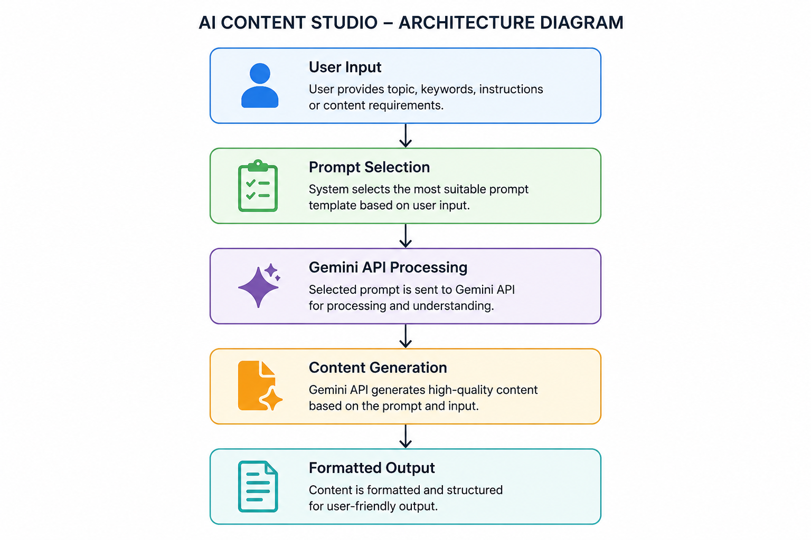
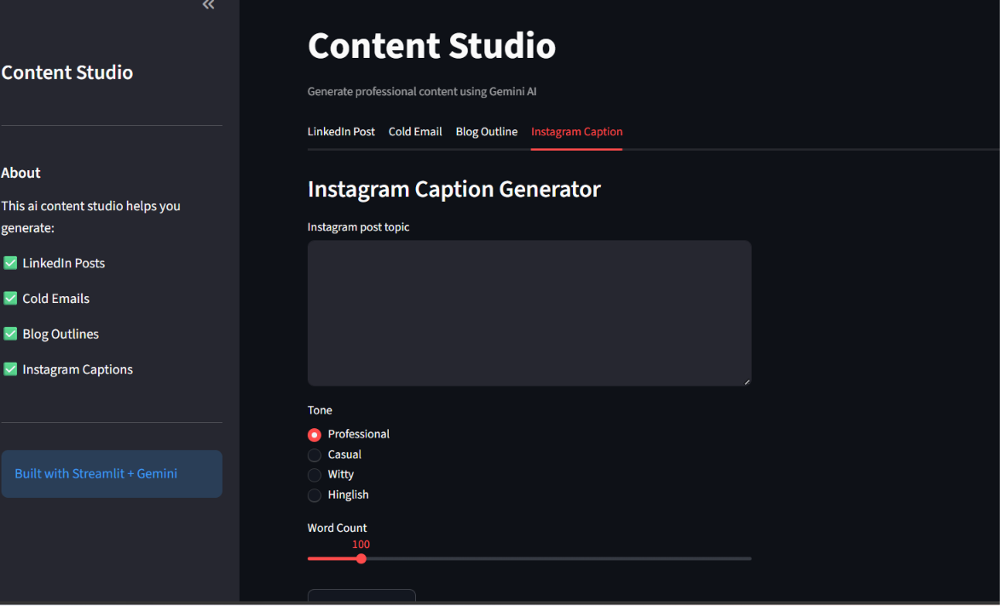
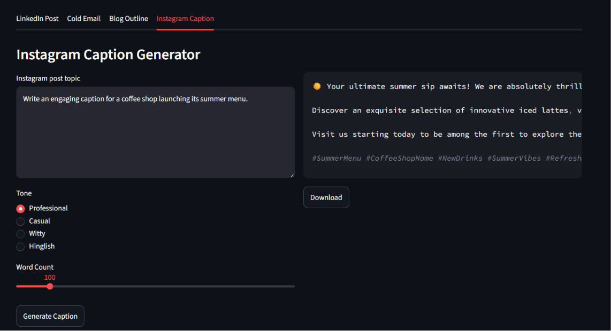

# 🤖 AI Content Studio

> Generate blogs, social media posts, marketing copy, and creative content in seconds using the power of Gemini AI.

[](https://content-studio-lrkurmdksxv2n2rgsaws2w.streamlit.app/)
[](https://huggingface.co/spaces/jathinvaikuntam/ai-content-studio)
[](https://github.com/jathinvaikuntam/content-studio.git)

---

## ✨ What it does

AI Content Studio helps creators, students, marketers, and entrepreneurs generate high-quality content without staring at a blank page. Simply choose the type of content you need, provide a prompt, and let Gemini AI transform your ideas into polished drafts within seconds.

Whether you're writing blog posts, social media captions, product descriptions, or marketing content, the app accelerates your creative workflow and boosts productivity.

---

## 🎯 Features

- ✅ Generate blogs, articles, and long-form content
- ✅ Create engaging social media captions and posts
- ✅ Produce marketing copy and promotional content
- ✅ Support multiple content styles and tones
- ✅ Fast AI-powered responses using Gemini API
- ✅ Clean and interactive Streamlit interface

---

## 🏗 Architecture



```text
User Input
↓
Prompt Selection
↓
Gemini API Processing
↓
Content Generation
↓
Formatted Output
```

---

## 🛠 Tech Stack

- **Language:** Python 3.12
- **AI:** Google Gemini API
- **UI:** Streamlit
- **Deployment:** Hugging Face Spaces / Streamlit Cloud
- **Environment Management:** python-dotenv
- **Other Libraries:** Google GenAI SDK

---

## 🚀 Run Locally

```bash
# Clone the repository
git clone https://github.com/jathinvaikuntam/content-studio.git

cd ai-content-studio

# Create a virtual environment
python -m venv venv

# Activate the environment

# Windows
venv\Scripts\activate

# Install dependencies
pip install -r requirements.txt

# Add your Gemini API key
echo "GEMINI_API_KEY=your-api-key" > .env

# Run the application
streamlit run app.py
```

---

## 📸 Screenshots





---

## 🧠 What I Learned

* Building prompt-driven applications requires thoughtful prompt design to generate better outputs.
* Managing API keys securely using environment variables is essential for production-ready apps.
* Designing a simple user experience is often harder than writing the underlying code.

---

## 🔮 Future Improvements

* [ ] Add support for additional content templates
* [ ] Enable exporting generated content to PDF and DOCX
* [ ] Introduce content history and saved drafts
* [ ] Add multilingual content generation
* [ ] Provide SEO optimization suggestions

---

## 👋 About Me

Built by **Jathin** as part of a **30-Day AI Engineering Sprint**.

**LinkedIn:** https://www.linkedin.com/in/jathin-vaikuntam-a37a2a409/

---

## 📄 License

This project is licensed under the MIT License.

Feel free to use, modify, and distribute this project in accordance with the license terms.
